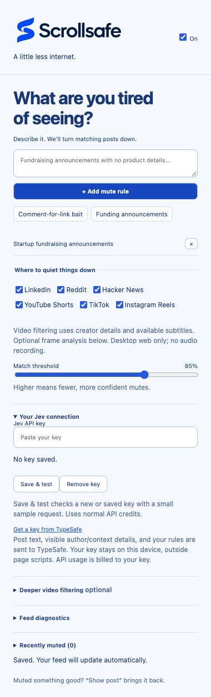

# Scrollpatrol

<picture>
  <source media="(prefers-color-scheme: dark)" srcset="docs/brand/scrollpatrol-wordmark-dark.png">
  <source media="(prefers-color-scheme: light)" srcset="public/brand/scrollpatrol-wordmark.png">
  
</picture>

**A little less internet.** An open-source Chrome extension that mutes posts by meaning, with Jev.

Describe what you don't want to see: “engagement bait asking me to comment for a link,” “startup funding announcements,” or “arguments about return-to-office policies.” Matching posts collapse into a small strip. **Show post** brings them back.

## Try it

1. Install Node.js 22+ and run `npm ci && npm run build`.
2. Open `chrome://extensions`, enable **Developer mode**, select **Load unpacked**, and choose `dist/`.
3. Open Scrollpatrol from the extensions menu. Add your own [TypeSafe API key](https://console.typesafe.ai) and one or more mute rules. **Save & test** makes a small Jev request and reports whether a valid response came back, with latency and the check time.
4. Open or reload a supported feed. The popup lets you pause filtering, disable individual sites, and adjust the match threshold.

The source is free and MIT licensed. Jev is a hosted API, not an included local model; your API usage is billed by TypeSafe. This is an unpacked alpha, not a Chrome Web Store release.

## Preview



## What the filter knows

Posts are sent as structured data, including the body and available author name/headline, visible promotion label, reaction/repost context, link-card titles and domains, and detected media types. Reddit also includes the username, community, and flair; Hacker News labels its username as the **submitter**, not the linked article author.

Author rules use the actual post owner rather than names mentioned in the body, commenters, or people who liked/reposted it. Unknown metadata is omitted; sponsorship is not inferred from promotional language. No profile visits, linked-page fetching, or private-message reading is performed. Frame analysis is available only when explicitly enabled below. Link tracking parameters are not sent. The model still makes probabilistic decisions; author extraction is strongest on the verified English LinkedIn layout, and unknown/localized layouts may omit fields.

Metadata participates in caching and change detection: identical text from different authors is classified separately, and updates to visible author metadata trigger rechecking. Feed diagnostics show the extracted author with recent scores.

## Connection checks and mute history

Open **Your Jev connection** and click **Save & test** to check a pasted or previously saved key. Pasting shows an explicit unsaved-key hint; connection feedback stays beside the field. Failed checks keep the draft in place, and storage/messaging failures are shown inline. A saved key is not shown as connected until a live test succeeds. The test checks authentication and the response format, not real-world classification accuracy; it uses a tiny sample post and incurs normal API usage.

**Recently muted** is a collapsed debugging panel with the latest 50 muted posts: excerpt, extracted author, original post link when available, matching rule, score, evidence source (metadata, subtitles, sampled frames), site, and timestamp. It records posts actually collapsed by the content script, including cached decisions. It is a historical log, so entries remain after you reveal a post or disable filtering. Repeated posts are deduplicated. **Clear history** removes the local log. No log is uploaded.

Open **Feed diagnostics → Check this tab** from a supported feed to inspect detected/readable post counts, checked/muted counts, errors, and the five latest scores. Reddit diagnostics also show username/subreddit coverage and extracted samples; muted history includes the subreddit. These diagnostics stay in the current tab’s memory. After reloading the extension, refresh existing feed tabs so they use the new script.

## First sites

- **LinkedIn:** feed post text at `/feed/`.
- **Reddit:** modern `shreddit-post` feeds, `shreddit-ad-post` ads, and old Reddit link listings.
- **Hacker News:** story titles, with their score/comment metadata hidden together.
- **YouTube Shorts, TikTok, Instagram Reels (desktop web, beta):** creator names and available titles, captions, hashtags, and sound labels. Each has its own toggle. YouTube is limited to `/shorts/`, Instagram to the `/reels/` viewer, and TikTok to For You, Following, and Friends feeds.

Matched short videos are covered in place and paused, with a **Show video** button. Scroll normally to the next video. Revealing restores the player; press play if needed. Rules also recheck existing cards and newly loaded/recycled players. By default, filtering uses metadata and available subtitle text; optional deeper filtering can add sampled visual evidence. A clip may still fail to match when the relevant speech has no subtitles or the relevant scene is outside the sampled frames. Video browser tests use simulated feeds and mocked model responses; real-video model accuracy is not benchmarked.

Comments, private messages, continuous video/audio analysis and full linked articles are outside this version. The LinkedIn adapter covers both legacy cards and the current list-item layout observed on a logged-in feed. Fixture and Chromium tests cover detection, text extraction, and collapsing. Automated Chromium tests verify username-only and subreddit-only rules, ad cards, infinite-scroll additions, and old Reddit using mocked Jev scores; live model accuracy is not comprehensively benchmarked. Site markup can change.

## Deeper video filtering

Available subtitles are included automatically: loaded native caption/subtitle tracks, plus YouTube subtitles rendered inside the player. Scrollpatrol does not enable captions, download hidden transcript tracks, or record/transcribe audio. Subtitles may be partial or unavailable, especially when burned into the video. Rendered captions accumulate per video, up to 4,000 characters, with rechecks at most once every five seconds.

To enable visual evidence, open **Deeper video filtering**, add a [Google AI Studio key](https://aistudio.google.com/apikey), and click **Save & test image access**. The test sends a generated image and verifies the response format, not real-world model accuracy. Then enable **Analyze frames when needed**. This remains off by default and requires the existing Jev key and rules for feed filtering.

Jev first checks metadata/subtitles and assesses whether visual evidence would help. If needed, Scrollpatrol samples up to two frames, 900 ms apart during normal playback, without seeking or recording audio. Only visible, decoded videos are sampled. Images are resized to at most 384 pixels per side and sent to Gemini 2.5 Flash-Lite for a description and readable on-screen text. The description is passed to Jev for the final rule decision. Cross-origin/protected players can block capture: those stay on metadata filtering, with the reason shown in **Feed diagnostics**. There is no whole-page screenshot fallback.

Descriptions are cached locally for seven days, up to 200 videos. Original frames are never persisted. Stable video links allow reuse across reloads; when a link is unavailable, cache identity uses the current media source and metadata, so reloading may require new analysis. Settings changes recheck cached evidence against the current rules.

The default **daily visual-analysis allowance is $0.10**, with **$0.001 reserved per attempt** (including the setup test, failures, and timeouts). That allows at most 100 attempts per UTC day; cached descriptions do not use an allowance. Reservations are written before requests and survive service-worker restarts. Clearing descriptions does not reset usage. Reported token usage provides a separate actual-cost estimate. This conservative local allowance is not a provider-enforced billing limit and excludes Jev costs; published model prices may change. [Gemini pricing](https://ai.google.dev/gemini-api/docs/pricing).

## Privacy and behavior

No analytics, account, backend, or remote executable code. Your keys and rules stay in Chrome local storage (not sync). Only the extension's trusted contexts can read that storage. The service worker sends up to 6,000 characters of nearby post text, bounded visible post metadata, up to 4,000 subtitle characters, optional visual descriptions, and your rules directly to `api.typesafe.ai` for classification. Do not use it on feeds whose text you do not want to send to TypeSafe; their data policies apply. The extension never sends cookies or collects general browsing history. It stores up to 50 muted-post excerpts (240 characters each), links, extracted author names, matching rules, scores, and timestamps locally until cleared or replaced by newer entries.

Classification runs sequentially as posts approach the viewport. Up to 1,000 decisions are cached in service-worker memory; they expire when the worker stops or settings change. A page reload may therefore generate more API usage. Each post evaluates at most 10 rules in one API request. Feed classification does not run until a key and a rule are configured. Connection tests only require a saved key. Posts stay visible during evaluation and on failure. API HTTP failures trigger a one-minute cooldown. Jev usage has no dollar cap; optional vision has the conservative request allowance described above. Use provider billing controls for account-wide limits.

The default match threshold is 85%. This is a model score, not a guarantee. Posts are untrusted input and the classifier is instructed to ignore instructions inside them; adversarial posts can still cause misclassification. Every mute is reversible. Pausing, changing rules, or disabling a site restores hidden posts and reevaluates the feed.

## Develop

```sh
npm ci
npm run typecheck
npm run build
npm test
npx playwright install chromium
node scripts/smoke.mjs
node scripts/reddit-smoke.mjs
node scripts/video-smoke.mjs
node scripts/enrichment-smoke.mjs
```

`src/adapters.ts` contains the site selectors. `src/core.ts` builds typed Jev questions and validates responses. The content script handles feed updates; the service worker owns the key and API requests. Build output contains all code locally, compatible with Manifest V3's script policy.

API contract: [TypeSafe API reference](https://docs.typesafe.ai/api).

## Experiments

[Initial live Jev measurements](benchmarks/REPORT-2026-09-22.md) include API latency, token-based cost estimates, metadata ablations, threshold sensitivity, repeated decisions, and a real-extension test on a synthetic feed. The dataset contains 36 assistant-labeled synthetic cases; this is not a representative real-feed accuracy benchmark. [Reproduce the experiments](benchmarks/README.md).

## Chrome Web Store preparation

Run `npm run package` to build `release/scrollpatrol-0.1.0.zip`, with the manifest at the ZIP root. Store listing copy, permission disclosures, reviewer instructions, and the upload checklist are in [store/LISTING.md](store/LISTING.md). The store release has not yet been submitted. Live provider accuracy still needs evaluation.

[Privacy policy](PRIVACY.md) · [Report an issue](https://github.com/ennsharma/scrollpatrol/issues)

## Brand assets

Approved wordmark and square icon originals live in `public/brand/`. Chrome uses 16, 32, 48, and 128 pixel PNG versions in `public/icons/`. The repository remains `ennsharma/scrollpatrol`; the extension display name is Scrollpatrol.
